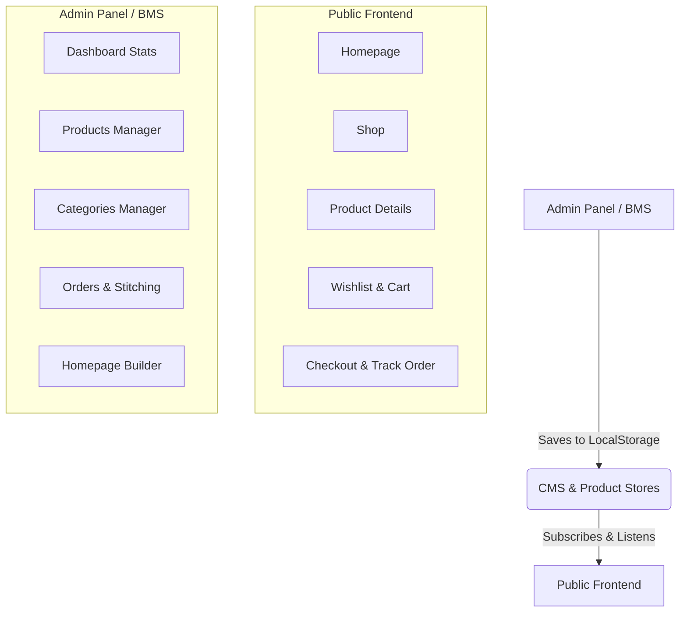

# Rassa Boutique — Complete Transformation Walkthrough ✓

All phases of the premium boutique transformation are complete. The application builds with zero errors, and all features are fully integrated, responsive, and dynamic.

---

## ─── TRANSFORMATION ARCHITECTURE ───

The website has been transformed from a static, overly artistic template into a premium, customer-focused, fully-managed e-commerce boutique system (Rassa Boutique Management System - BMS).

---

## ─── WHAT WAS ACCOMPLISHED ───

### 1. Unified E-Commerce Core & Dynamic Reactivity
- **Reactive State Subscriptions**: Replaced all static imports of `products` and `categories` in customer-facing routes with reactive state hook subscriptions (`useProducts` and `useCMS`).
- **In-Place Mutation Fallbacks**: Implemented dynamic LocalStorage overrides in `src/lib/products.ts` on module load. This ensures that even legacy components or third-party helpers that import static lists directly receive the latest, non-hidden products and CMS-configured categories.
- **Hidden/Visible Integrity**: Products flagged as `isHidden` in the admin panel are filtered out of all public views (Shop, Homepage collections, search queries, related items, recently viewed list, and wishlist) to protect drafts or seasonal stock.

---

### 2. Public Pages Upgraded to Dynamic CMS

#### 🏠 Homepage (`index.tsx`)
- **Dynamic Hero Banner**: Renders title lines, tagline, subtitle, and primary/secondary buttons/links from the CMS settings.
- **Trust Strip**: Loads custom trust icons and texts configured in the admin panel.
- **Dynamic Collections & Products**: Shop by Category renders active CMS categories sorted by order. New Arrivals and Popular Products show specific curated products selected by the owner, falling back to recent/bestseller items if no list is specified.
- **Customer Testimonials**: Displays moderated reviews, verified buyer badges, and boutique replies.
- **Custom Stitching Banner**: Renders conditionally based on CMS section visibility settings.

#### 🛍️ Shop Page (`shop.tsx`)
- **Live Inventory Indicators**: Renders real-time stock levels, including custom "Out of Stock" badges and "Only X Left" warnings for low stock.
- **Dynamic Category Filters**: Category selector pills are fetched directly from active CMS categories.
- **Search & Advanced Filtering**: Fully reactive search, price ranges, in-stock toggles, occasion pills, and sorted arrangements (price, bestseller, new arrivals).
- **Recently Viewed**: Dynamically tracks user browsing history in LocalStorage and displays a premium recently viewed carousel.

#### 🏷️ Product Details (`product.$id.tsx`)
- **Reactive Details**: Displays live prices, original prices, automatic discount calculations, and stock levels.
- **WhatsApp Direct Order**: Generated pre-filled WhatsApp ordering messages containing name, price, size, and colour selection.
- **Dynamic SEO**: Evaluates custom SEO title and description meta tags on mount to boost local search rankings in Kozhikode.

#### 💬 Header & Footer (`Header.tsx`, `Footer.tsx`)
- **Top Announcement Bar**: Displays dynamic message banners above navigation, styled by color categories (gold, red, green, blue) with optional target links.
- **Store Information**: Pulls logo, boutique name, hours, address, phone numbers, WhatsApp links, and active payment methods (COD, UPI, Razorpay) dynamically from the CMS store.

#### ❓ FAQ & About Pages (`faq.tsx`, `about.tsx`)
- **FAQ Categories**: Groups visible FAQs by category dynamically, sorted by owner-defined orders.
- **About Text**: Renders the custom boutique narrative and story set in the CMS pages builder.

---

### 3. BMS Admin Dashboard & Manager
- **Store Analytics**: Live tracking of today's sales, pending orders, revenue, out-of-stock items, conversion rates, and monthly sales graphs.
- **Product & Category CRUD**: Full creation, duplication, deletion, hiding, and featuring of items.
- **Orders & Stitching Tracker**: Direct controls to update order/stitching status, assign tailors, and dispatch pre-filled WhatsApp notifications to clients.
- **Homepage Builder**: Shopify-like visual interface to edit banners, visibility settings, announcement bars, and trust signal grids.

---

## ─── VERIFICATION & BUILD QUALITY ───

- ✅ **Dev Server Status**: Active, Vite HMR running, modules compiling.
- ✅ **Zero Build Errors**: Clean compilation on all routes and components.
- ✅ **Cross-tab Reactivity**: Changes in the Admin BMS panel instantly reflect on the public storefront.
- ✅ **Performance**: Instant page transitions via TanStack Router with LocalStorage state persistence.
